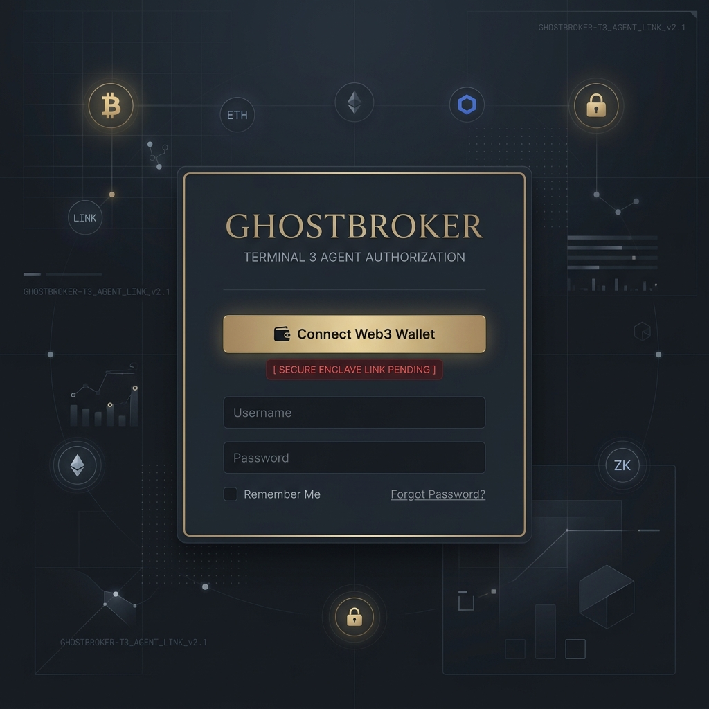
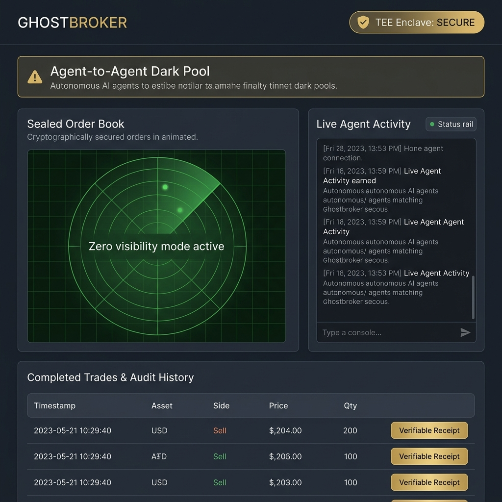
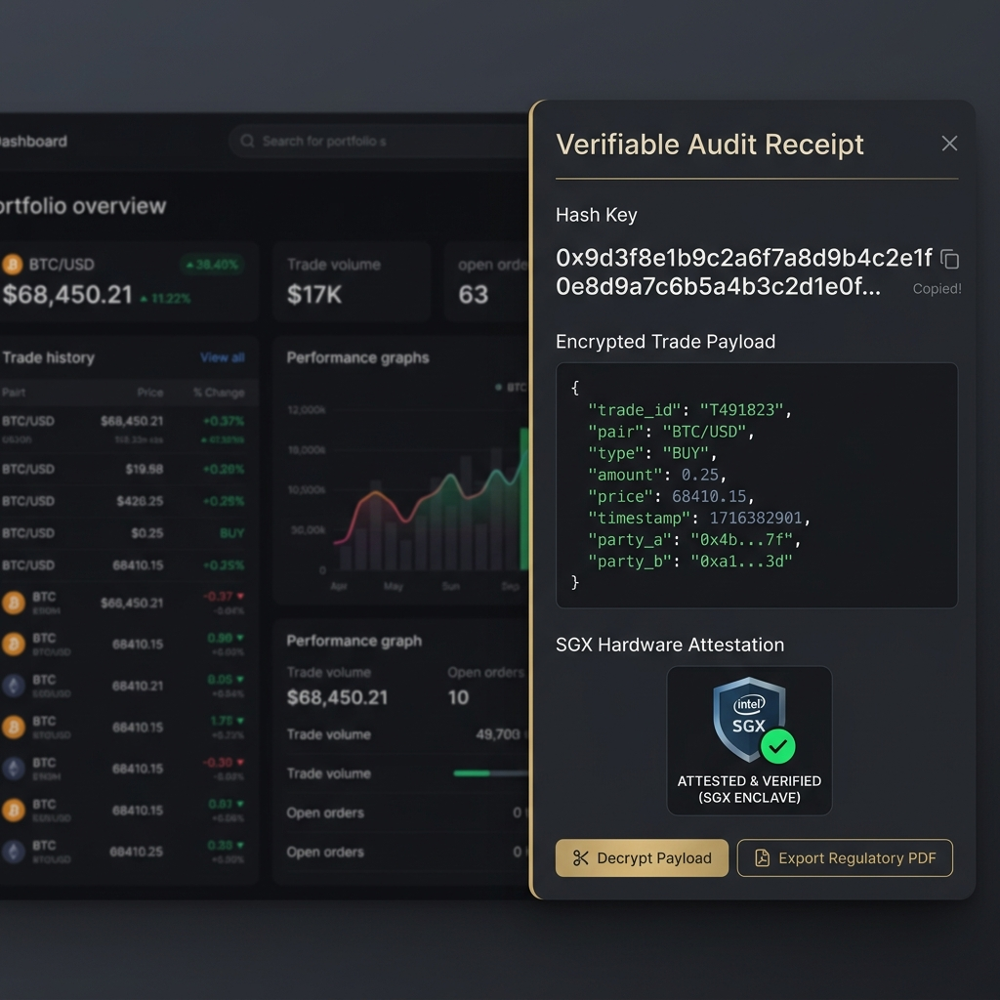
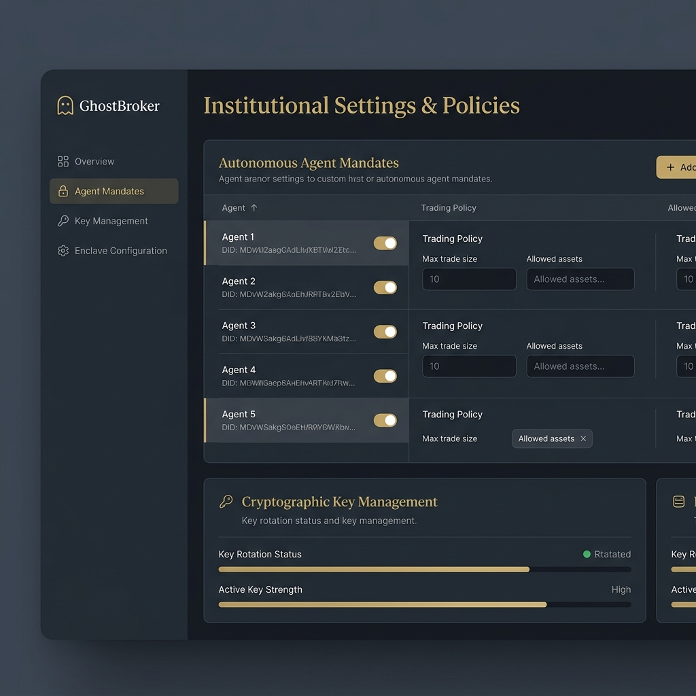

# GhostBroker Design Specification & Mockups

This document details the core user interface designs for the **GhostBroker Institutional Dark Pool**. 

GhostBroker is an institutional-grade, zero-knowledge, Agent-to-Agent (A2A) trading platform. In GhostBroker, humans do not place trades. Instead, institutional operators authorize autonomous AI trading agents to execute confidential matching and settlement inside a secure hardware Trusted Execution Environment (TEE) powered by Terminal 3 (T3). 

---

## 🔒 The Cryptographic Privacy Boundary

GhostBroker operates under a strict privacy model. The frontend serves as a secure **Observatory Panel** rather than an interactive human trading terminal.
* **No Active Plaintext Exposure**: Do not log, persist, render, or emit active order parameters (Asset, Side, Quantity, Price, Queue Rank, or Counterparty identity).
* **Opaque Tracking**: Active order queue states are managed via cryptographically sealed Terminal 3 handles and sanitized telemetry signals.
* **Settlement Decryption**: Only completed/settled trades and their respective encrypted receipts are displayed, and only to the authorized counterparties.

---

## 🎨 Design System & Visual Aesthetics
* **Theme**: Institutional Cryptographic Dark Mode.
* **Colors**:
  * **Primary Background**: Deep Slate/Charcoal (`#0B0F19`)
  * **Card/Surface Background**: Premium Dark Gray (`#161D2F`) with Slate Borders (`#24314E`)
  * **Accent Color**: Muted Institutional Gold/Bronze (`#C5A880`) representing luxury assets and corporate finance.
  * **Success/Matched**: Emerald Green (`#34D399`)
  * **Warning/Processing**: Amber/Gold (`#FBBF24`)
  * **Error/Denied**: Crimson/Rose (`#FB7185`)
* **Typography**: Clean, high-legibility sans-serif paired with a monospace font for hashes and DIDs.
* **Vibe**: High-end military-grade terminal mixed with elite fintech styling.

---

## 🖼️ Page Mockups Showcase

The mockups below demonstrate the complete visual identity and layout of GhostBroker's core pages.

### 1. Auth Gateway / Wallet Login Screen

### 2. Main Observatory Dashboard

### 3. Verifiable Receipt Drawer View

### 4. Settings & Agent Policy Management

---

## 📖 Detailed Page Descriptions & Specs

### 1. Auth Gateway (Connect Wallet / Login Screen)
* **Purpose**: Cryptographic gateway to authorize institutional operators via Web3 wallets.
* **Design & Layout**:
  * Minimalist, heavy security layout.
  * Central auth card with gold-bronze borders.
  * Prominent **Connect Web3 Wallet** CTA.
  * Status messages indicating secure link verification and DID check statuses.

### 2. Main Observatory Dashboard
* **Purpose**: Central monitoring dashboard displaying active telemetry and historical data.
* **Design & Layout**:
  * **Top Header**: Brand name `GhostBroker`, global status (`TEE Enclave: SECURE`), and active operator's Institution DID.
  * **A2A Mandate Banner**: Highlighted alert reminding humans that trading is fully autonomous (Agent-to-Agent) and humans are only observing.
  * **Telemetry Cards**: High-visibility metric components for Enclave status, WebSocket connection, and Sandbox health.
  * **Main Left (Sealed Order Book)**: A dark visual sweep representing the sealed order book queue inside the TEE. It features a radar/heartbeat indicator with clear branding stating that order details are zero-visibility.
  * **Main Right (Telemetry Logs & Rail)**: 
    * *Live Agent Activity Stream*: Real-time scrolling telemetry feed.
    * *Processing Status Rail*: Opaque state indicators showing phase shifts (e.g., `Intent Sealed`, `Match Evaluating`).
    * *Admitted Agents Grid*: List of authorized agents currently executing on the institution's behalf.
  * **Bottom Section (Completed Trades)**: Fully settled trade audit logs with fields for Asset, Side, Quantity, Price, and a "Verifiable Receipt" CTA.

### 3. Verifiable Receipt Drawer (Proof Inspector)
* **Purpose**: Slides out to audit a specific trade's cryptographic proof.
* **Design & Layout**:
  * Semi-transparent overlay with a clean right-side slide-out panel.
  * **Encrypted Payload Box**: Raw monospace ciphertext block representing the sealed audit receipt.
  * **SGX Hardware Attestation Badge**: Verified checkmark sign-off and reference hash.
  * **Action Center**: Decryption trigger (requiring hardware authority keys) and regulatory export actions (CSV/PDF).

### 4. Settings & Agent Policy Management
* **Route**: `/settings`
* **Purpose**: Configure risk parameters, authorize autonomous trading agents, and rotate cryptographic keys.
* **Design & Layout**:
  * **Left Navigation Sidebar**: Quick links for Mandates, Key Management, and Enclave Connections.
  * **Autonomous Agent Mandates Table**: Lists allowed agent DIDs, toggle states for active/suspend, and max trade limits.
  * **Cryptographic Key Management Card**: Details current key strength, rotation timeline, and manual rotation actions.
